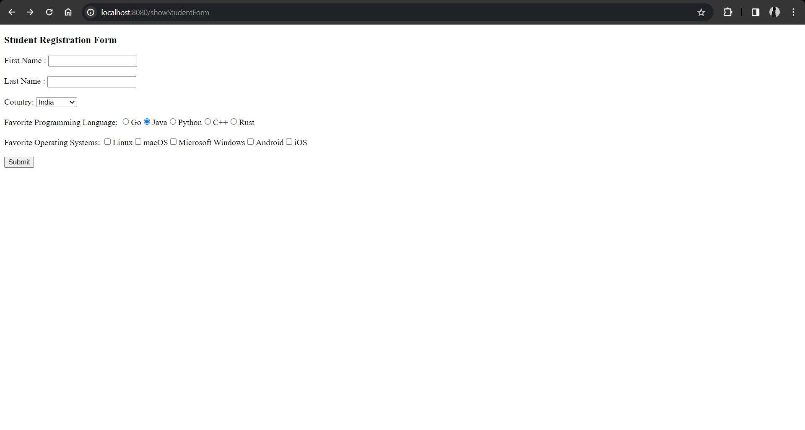

# Spring Boot & Thymleaf Documentation



## Overview

Welcome to the Spring Boot Application, a project built with Spring, incorporating the powerful features of Spring Web and Thymeleaf. This application showcases three main functionalities accessible through different endpoints.

## Setup

1. **Initialize the Project:**
   - Visit [Spring Initializer](https://start.spring.io/).
   - Add dependencies: `Spring Web` and `Thymeleaf`.
   - Generate and download the Maven project.

2. **Import Project:**
   - Import the downloaded project into your favorite IDE.

3. **Run Application:**
   - Run the main class, typically named `Application.java`.
   - The application will be available at `http://localhost:8080`.

## Functionality 1: Demo Webpage

### Endpoint: http://localhost:8080/hello

This simple demo webpage provides a welcome message.

- **How to Access:**
  - Open your browser and navigate to [http://localhost:8080/hello](http://localhost:8080/hello).

- **Functionality:**
  - Displays a welcome message.

## Functionality 2: Hello World Webpage

### Endpoint: http://localhost:8080/showForm

This webpage takes the user's name as input and displays a personalized welcome message.

- **How to Access:**
  - Open your browser and navigate to [http://localhost:8080/showForm](http://localhost:8080/showForm).

- **Functionality:**
  - User inputs their name in a form.
  - Upon submission, a personalized welcome message is displayed.

## Functionality 3: Student Details Webpage

### Endpoint: http://localhost:8080/showStudentForm

This webpage allows users to provide their details, including first name, last name, country, and favorite programming language.

- **How to Access:**
  - Open your browser and navigate to [http://localhost:8080/showStudentForm](http://localhost:8080/showStudentForm).

- **Functionality:**
  - User inputs their details in a form.
  - Upon submission, the provided details are displayed.

## Sample Code

```java
// Sample controller code for Hello World Webpage
@Controller
public class StudentController {

    @Value("${countries}")
    private List<String> countries;

    @Value("${languages}")
    private List<String> languages;

    @Value("${systems}")
    private List<String> systems;

    @GetMapping("/showStudentForm")
    public String showForm(Model theModel){

        Student theStudent = new Student();

        theModel.addAttribute("student",theStudent);
        theModel.addAttribute("countries",countries);
        theModel.addAttribute("languages",languages);
        theModel.addAttribute("systems",systems);

        return "student-form";
    }

    @PostMapping("/processStudentForm")
    public String processForm(@ModelAttribute("student") Student theStudent){

        System.out.println("theStudent : " + theStudent.getFirstName() + " "
                        + theStudent.getLastName());

        return "student-confirmation";
    }
}
